# Architecture

TestForge proposes test cases for one exported function, turns them into Vitest tests with a fixed template, runs them against temporary copies of the project, and reports which hypothetical code changes (mutations) the tests detect. Nothing touches the workspace until the user presses Apply.

## Modules

| Path | Responsibility | Must never |
|---|---|---|
| `src/core/types.ts` | Shared contracts: `LIMITS`, stages, terminal statuses, failure kinds, model response schema v1 (zod), `RunReport` | Import `vscode` |
| `src/core/util.ts` | sha256, run IDs, canonical JSON, per-workspace mutex | Import `vscode` |
| `src/core/pipeline.ts` | Runs one Generate & Verify run end to end and always returns a `RunReport`. Cleans up in `finally` | Write to the workspace. Import `vscode` |
| `src/analysis/analyze.ts` | Parses with bundled TypeScript 6.0.3. Finds eligible exports, checks project support, walks the relative import closure, finds adjacent tests, hashes inputs, detects secrets | Execute project code. Read files outside the import closure and adjacent tests (apart from `package.json`, the lockfile and the version fields of installed vitest/typescript) |
| `src/generation/prompt.ts` | Builds the prompt: schema, rules, and closure files labeled `F1..Fn` with line numbers | Include files that analysis did not approve |
| `src/generation/validate.ts` | Parses model text (one optional ```` ```json ```` fence), validates schema/export/evidence/JSON limits, fingerprints cases, detects duplicates and conflicts | Evaluate model output as code |
| `src/generation/render.ts` | Deterministic Vitest source from validated cases (D6) | Put model text anywhere except JSON-escaped string literals and sanitized `//` comments |
| `src/execution/workspace.ts` | Owned temp run dirs (sentinel file), file copies, `node_modules` symlink, extension-owned Vitest config and tsconfig, stale-dir cleanup | Delete a directory without the sentinel. Install dependencies |
| `src/execution/runner.ts` | Resolves Node and the target's `tsc`/`vitest` CLIs. Spawns them with `shell:false`, a filtered env, bounded output, deadlines and process-group kill. Parses Vitest's JSON report | Use a shell. Pass the full user environment |
| `src/mutation/mutate.ts` | Enumerates relational / strict-equality / boolean-return mutations in the selected body. Applies one at a time to pristine text. Classifies, scores, compares | Mutate nested functions or type positions. Count timeouts/errors in a score |
| `src/providers/provider.ts` | `ModelProvider` interface (text in, text out) and `ProviderError` | Write files or run tools |
| `src/providers/fake.ts` | Deterministic fake provider for tests and demo mode (canned cases for the fixture functions) | Pretend to be an AI model. Reports say `DEMO` |
| `src/providers/vscodeLm.ts` | Real provider via `vscode.lm`: token count vs `maxInputTokens`, streamed response with a 128 KiB cap, cancellation, error mapping | Use API keys. Hardcode a model family |
| `src/storage/apply.ts` | History pruning (10 runs / 7 days), freshness checks (hashes, dirty buffers, new adjacent tests), guarded exclusive-create apply | Overwrite an existing file. Write through a symlink or outside the workspace |
| `src/extension.ts` | Commands, CodeLens, target picking, trust and dirty-file guards, consent, model selection, progress/cancel, output channel, read-only previews (`testforge-preview:` scheme), history in `workspaceState` | Log file contents. Run without a trusted workspace |
| `src/ui/results.ts` | **TestForge Results** tree: Run, Cases, Test Results, Mutation Checks, Limitations, with status spelled out in text | Show a score that did not come from an execution |

`src/core`, `analysis`, `generation`, `execution`, `mutation`, `storage`, `providers/provider.ts` and `providers/fake.ts` do not import `vscode` (D5). This lets the whole pipeline run under Vitest.

## Pipeline stages

`preflight` → `snapshotting` → `checking-baseline` → `generating` → `validating-candidates` → `checking-mutations` → `improving` → `reporting` → `completed`

1. **preflight**: `analyzeTarget` checks the support matrix and freezes inputs (hashes of closure files, adjacent tests, `package.json` and `package-lock.json`).
2. **snapshotting**: creates a temp run dir with an `original` copy and resolves Node and the tools. The original copy must pass `tsc`.
3. **checking-baseline**: runs the adjacent tests twice. A failing test, a run that does not complete, or two runs that disagree all stop the run.
4. **generating**: one model request plus at most one correction retry when validation fails.
5. **validating-candidates**: renders the tests, type-checks them, and runs baseline + generated tests twice against the original code. If any generated case fails or times out, the run is kept for review and mutation scoring is skipped (`partial`).
6. **checking-mutations**: for each sampled mutation, writes the mutant from pristine text, runs `tsc` (a compile failure is `invalid`), then runs one Vitest run. The baseline and generated outcomes are both read from that single report.
7. **improving**: **placeholder**. It only adds a limitation when mutations survived. No model request is made.
8. **reporting**: removes the run dir and sets the terminal status.

Terminal statuses: `completed`, `partial` (deadline reached, no acceptable cases, or candidates failing/timing out on the original), `unsupported`, `blocked` (also used for setup problems and secrets), `failed`, `cancelled`.

Mutation outcomes: `killed`, `survived`, `invalid`, `timeout`, `error`, `not-run`. Score = killed / (killed + survived). N/A when that is 0. The before/after comparison uses only mutations valid for both suites.

## Data flow

The model returns **data only**. The validator turns it into case records. The renderer, which is deterministic code, writes the test source.

```mermaid
flowchart LR
  A[analyzeTarget<br/>closure + adjacent tests] --> P[buildPrompt<br/>F1..Fn with line numbers]
  P --> M[ModelProvider<br/>vscode.lm or fake]
  M -- raw text --> V[parseModelText + validatePlan<br/>zod, evidence, JSON limits]
  V -- CaseRecords --> R[renderTests<br/>fixed template]
  R --> C[(temp copy)]
  C --> T[tsc + Vitest<br/>original, then each mutant]
  T --> Rep[RunReport]
  Rep --> UI[tree view / preview]
  UI -- explicit Apply --> W[module.testforge.runId.test.ts]
```


